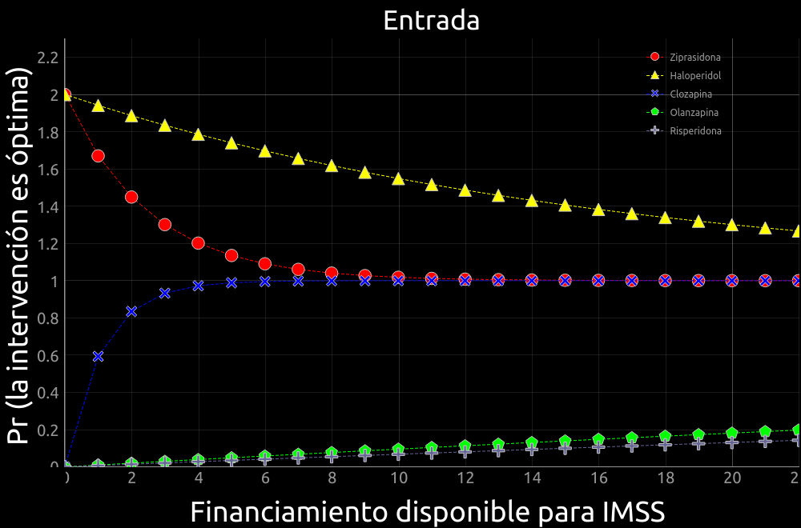
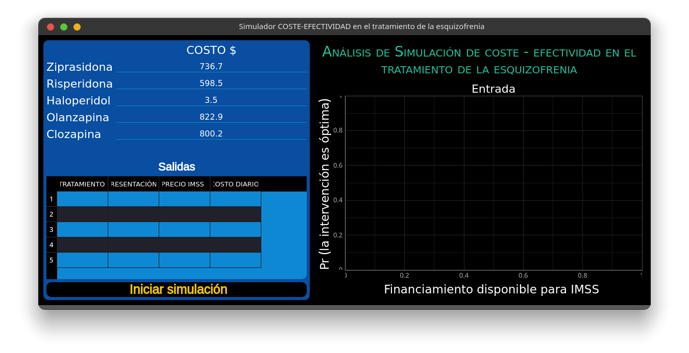

# SIMULADOR COSTE - EFECTIVIDAD EN EL TRATAMIENTO DE LA ESQUIZOFRENIA

## proyecto de simulación 

> Instalar python en su versión 3.x

### Instalar dependencias
```bash
   $ pip install numpy

   $ pip install mysql-connector-python

   $ pip install PyQt5

   $ pip install QtPy

   $ pip install pyqtgraph
```

**Con estas librerias instaladas ya se puede ejecutar el simulador.**
### Capturas



### Documentación
[Revista de Psiquiatría y Salud Mental](13141288_alt.pdf)
